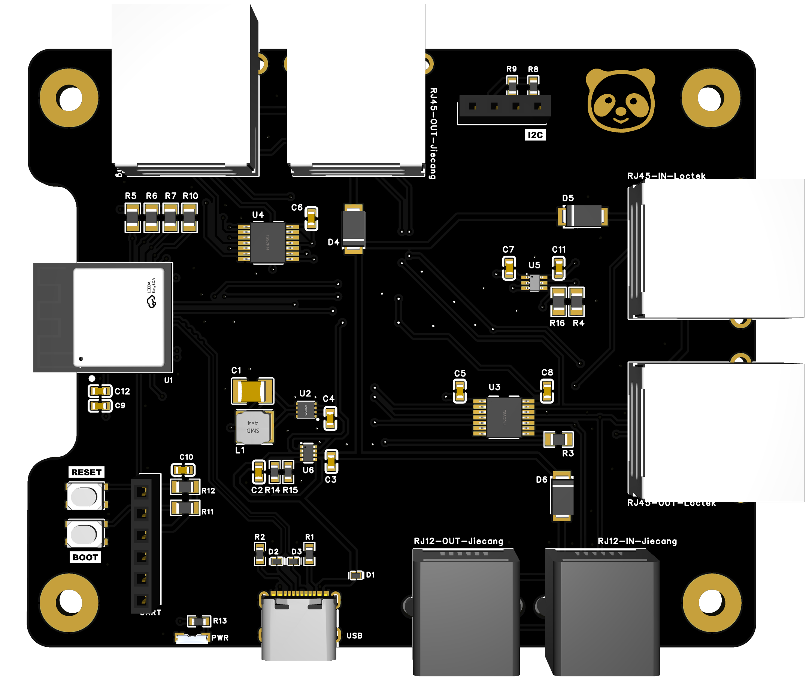
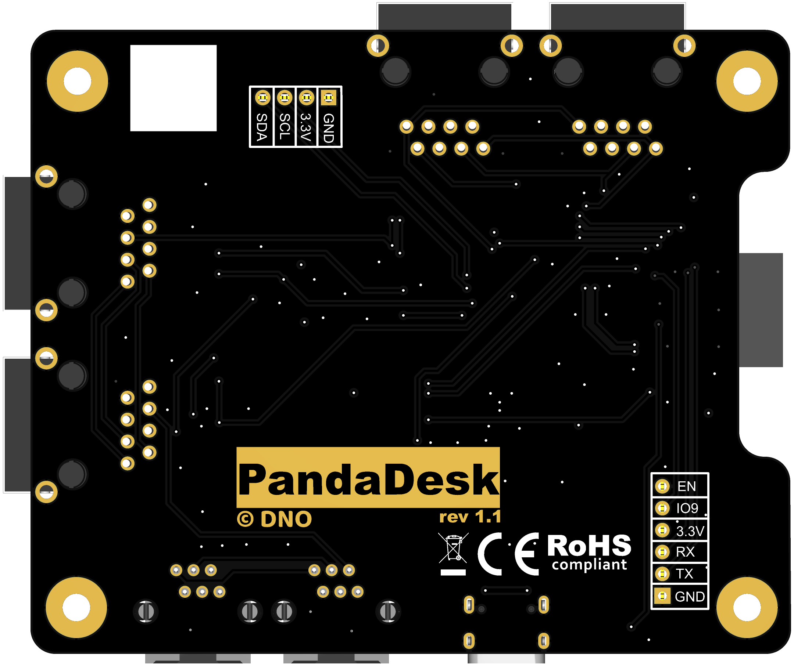

# PandaDesk


PandaDesk is an ESP32-C6-based adapter for electrically height-adjustable desks. It is designed to add programmable and wireless control while retaining the original handset where the desk interface supports inline operation.

The board provides dedicated connectors for three common desk-interface families instead of trying to route arbitrary pins through a universal matrix. Firmware profiles provide the model-specific UART protocol, wake sequence, and control-line behavior.

> [!IMPORTANT]
> PandaDesk V1 is currently a prototype. Hardware files are available for review, but individual desk/controller combinations must be tested before they are listed as supported.

## Features

- ESP32-C6-MINI-1-N4 with Wi-Fi, Bluetooth LE, and native USB
- Jiecang RJ12 / 6P6C IN and OUT ports
- Jiecang/Jarvis RJ45 / 8P8C IN and OUT ports
- Loctek/FlexiSpot RJ45 / 8P8C IN and OUT ports
- Original-handset support through firmware-managed UART forwarding
- Dedicated 3.3 V / 5 V UART level translation
- Four open-drain outputs for Jiecang handset/control signals
- Dedicated Loctek wake output
- USB-C or compatible 5 V desk power, with automatic USB priority
- Efficient 3.3 V switching regulator
- Boot and reset buttons
- Firmware-controlled status LED
- I²C expansion header
- Internal UART production-programming header
- Four-layer PCB with mounting holes and an ESP32 antenna cutout

## Supported interface targets

| Interface | Connector | Intended use | Status |
|---|---|---|---|
| Jiecang | RJ12 / 6P6C | Accessory port or supported inline configuration | Prototype validation required |
| Jiecang / Jarvis | RJ45 / 8P8C | Inline between handset and controller | Prototype validation required |
| Loctek / FlexiSpot | RJ45 / 8P8C | Inline between handset and controller | Prototype validation required |

Connector type and manufacturer name alone do not establish compatibility. Pinouts and protocols can differ between models from the same manufacturer. A verified compatibility list will be maintained as hardware and firmware testing progresses.

Only one desk/interface pair may be connected at a time.

## How it works

For a typical inline installation:

```text
Original handset ──> PandaDesk IN
PandaDesk OUT    ──> Desk controller
```

The controller-to-handset UART direction remains connected through the board and is also monitored by the ESP32. The handset-to-controller direction passes through the ESP32:

```text
Handset TX ──> level translator ──> ESP32 handset RX
ESP32 TX   ──> level translator ──> Controller RX

Controller TX ──> Handset RX
              └─> level translator ──> ESP32 controller RX
```

This lets the firmware forward handset packets and insert PandaDesk commands between complete protocol transactions. It must never mix bytes from two commands or echo controller responses back to the controller.

When PandaDesk is connected to a supported free accessory port, only the corresponding **OUT** connector is used and **IN** remains empty.

> [!NOTE]
> The handset transmit path is not a passive bypass. The board must be powered and the firmware must be running for inline handset commands to reach the controller.

## Firmware architecture

Firmware is organized around desk profiles. Each profile defines:

- Interface family and operating mode
- UART baud rate and framing
- Packet boundaries and checksums
- Commands, responses, polling, and timeouts
- Wake method and timing
- Jiecang control-line functions
- Movement and stop behavior
- Recovery after framing errors, reset, or communication loss

The firmware needs two simultaneous receive paths and one transmit path:

| Signal | ESP32-C6 GPIO | Purpose |
|---|---:|---|
| `E_TX` | 19 | UART output to the desk controller |
| `E_RX` | 18 | UART input from the desk controller |
| `E_RX_HANDSET` | 5 | Separate UART input from the original handset |
| `EN_TX` | 15 | Common enable for the UART translator |
| `E_WAKE` | 14 | Loctek wake output |
| `E_HS0` | 23 | Jiecang open-drain control 0 |
| `E_HS1` | 22 | Jiecang open-drain control 1 |
| `E_HS2` | 21 | Jiecang open-drain control 2 |
| `E_HS3` | 20 | Jiecang open-drain control 3 |
| `LED` | 7 | Status LED |

`EN_TX` enables the translator's transmit output and both receive outputs together. It must remain enabled while waiting for handset UART activity. Pulling it low also prevents the ESP32 from receiving the handset and controller UART signals.

Manual handset actions should take priority over automations. All traffic to the controller should pass through one transmit queue so that only one complete packet is sent at a time. Firmware must not replay stale movement commands after reset, buffer overflow, or loss of synchronization.

### Loctek wake handling

Loctek OUT pin 4 is driven by the dedicated wake circuit. Handset IN pin 4 is intentionally not connected or monitored in V1. The planned firmware behavior is:

1. Keep handset UART reception active while the controller is asleep.
2. Detect valid handset UART activity or a local PandaDesk command.
3. Buffer the first packet and assert the wake output.
4. Wait for the model-specific ready condition or delay.
5. Send the buffered packet and release or hold wake as required by the profile.

This method must be validated for every supported Loctek/FlexiSpot combination. A handset that only toggles pin 4 and waits before sending UART data cannot be detected by V1.

### Safe startup

At startup, firmware should:

1. Keep the UART translator disabled.
2. Keep Loctek wake inactive.
3. Release all Jiecang open-drain outputs.
4. Load and validate the selected desk profile.
5. Initialize both UART receivers and the transmit queue.
6. Set desk TX to the normal UART idle level.
7. Enable the translator and perform profile-specific wake or initialization.

Debug and boot messages must never be routed to the desk UART output. Runtime diagnostics should preferably use native USB.

## Power

PandaDesk can be powered from USB-C or from a compatible 5 V desk interface. The TPS2116 power multiplexer automatically gives USB priority. Desk supplies are diode-isolated before they are combined, and a TPS62162 generates the 3.3 V rail.

A desk exposing a 5 V pin does not necessarily provide enough current for PandaDesk, the original handset, and ESP32 Wi-Fi current peaks. Desk-powered operation must be qualified for each supported model. USB-C should be used when the desk supply is unknown or insufficient.

## Voltage limits

> [!CAUTION]
> All signals and supply pins connected to PandaDesk must remain within **0–5 V**. Interfaces carrying higher voltages are not supported and may damage PandaDesk or the desk controller.

The board uses fixed 3.3 V / nominal 5 V interface circuitry. It is not a universal voltage-detection or arbitrary-pin-routing device.

## Hardware files

| File | Contents |
|---|---|
| [`ProPrj.epro2`](ProPrj.epro2) | EasyEDA Pro schematic, PCB, and embedded libraries |
| [`SCH.pdf`](SCH.pdf) | Schematic export |
| [`Gerber.zip`](Gerber.zip) | PCB manufacturing files |
| [`BOM.xlsx`](BOM.xlsx) | Bill of materials |
| [`PickAndPlace.xlsx`](PickAndPlace.xlsx) | Component placement data |
| [`PandaDesk_Projektzusammenfassung.md`](PandaDesk_Projektzusammenfassung.md) | Detailed German engineering notes and firmware requirements |

PCB renders:

| Top | Bottom |
|---|---|
|  |  |

## Current status

The schematic, PCB, BOM, placement file, and Gerbers have received an initial cross-check. Component references and placement data are consistent, and an approximate four-layer connectivity check found no obvious opens or shorts.

The following items remain before the first prototype order:

- Add LCSC part number `C5736265` to the U1 BOM entry or map the exact ESP32-C6-MINI-1-N4 during assembly setup.
- Resolve or explicitly approve the two vias inside the U2 exposed solder pad.
- Confirm that duplicate via coordinates in the general PTH and separate via drill files are processed once by CAM.
- Verify all connectors and the mixed-technology USB-C receptacle in the assembly preview.
- Run native EasyEDA ERC/DRC and regenerate all outputs from the same project revision.
- Preferably shorten and widen the U2–L1–C1 regulator output path.

The first build should be a small prototype batch followed by power, USB-priority, UART-forwarding, wake, fault-recovery, and real-desk tests.

## Repository

Project development and releases:

**<https://github.com/derDeno/PandaDesk>**

Issues and test reports should identify the desk model, controller model, handset model, connector, measured voltage, and firmware profile used. Do not report a desk as compatible based only on its connector or brand.

## Contributing

Contributions are welcome, especially:

- Verified protocol captures and documentation
- New desk profiles
- Tests for UART forwarding, wake behavior, and command arbitration
- Confirmed controller/handset compatibility reports
- Hardware review and prototype measurements

Please avoid publishing unverified pinouts as working configurations. Include measurements and exact hardware identifiers whenever possible.

## License

PandaDesk is licensed under the [Creative Commons Attribution-NonCommercial-ShareAlike 4.0 International License](LICENSE).

You may copy, redistribute, and adapt the project for noncommercial purposes provided that you:

- Give appropriate credit to **derDeno / PandaDesk** and link to this repository
- Link to the CC BY-NC-SA 4.0 license and indicate whether changes were made
- Publish adaptations under the same CC BY-NC-SA 4.0 license

Commercial use is not permitted under this license. Contact the project owner if you require separate commercial permission.
